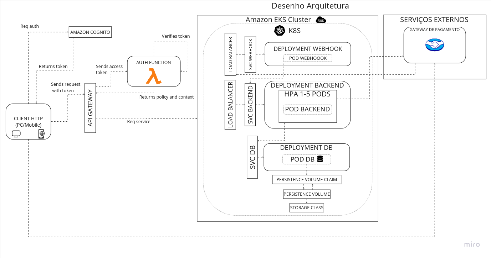

# Pós Tech Software Architecture - Tech challenge 3

### Alunos

- Débora Silveira - RM353919
- Eduardo Petri - RM353438
- Fernanda Serra - RM353224

### O que é o projeto?

Implementação da solução para a especificações do tech challenge #3 disponibilizada pela FIAP para o curso de pós graduação em Arquitetura de Software. Esse repositório contém a implementação de infraestrutura utilizando API Gateway e AWS Lambda serverless function.

### Documentação do sistema

[Miro](https://miro.com/app/board/uXjVKUrPAdA=/?share_link_id=25578601860) contém:

- Event storming
- MER
- Desenho da arquitetura



### Requisitos

Ter [kubernetes](https://kubernetes.io/releases/download/), [docker](https://docs.docker.com/get-docker/), [git](https://git-scm.com/downloads) e [AWS CLI](https://aws.amazon.com/cli/) instalados.

### Como iniciar localmente

Para essa etapa do tech challenge, utilizamos o kubernetes para subir a aplicação na Amazon Web Services (AWS). Como a função de autenticação foi implementada usando os serviços da AWS, é necessário executar comandos de configuração pelo CLI disponibilizado por eles.

Para o build e deploy da Lambda:

```bash
$ unzip aws-sam-cli-linux-x86_64.zip -d sam-installation
$ sudo ./sam-installation/install
$ cd src
$ sam build
$ sam deploy --guided
```
